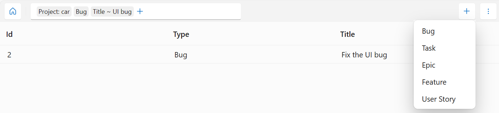

# Violet WorkItems

WorkItems intents 😀 to be a flexible work item management system.

## Project Goals

Having Goals is the first step in achieving them 😀

- 🏃‍♂️ Create a customizable work item management system for mid-size usage (> 10 projects, > 100 users, > 10k work items).
- 🏃‍♂️ Create a compelling [user interface](docs/screenshots/README.md) and a API layer for customized applications.
- 🏃‍♂️ Create proof of concepts applications covering ToDo Lists, Kanban Board and fixed property issue tracker.
- 🔜 Create a framework for programmatically managing work items (e.g. check tracing completeness).
- 🔜 Create a set of standardized providers for common work item management systems (GitHub, GitLab, TFS, Jira, ...).

## Class Libraries

The WorkItems project follows an onion architecture with re-usable components.

### Domain Model

1. Violet.WorkItems.Abstractions
   - ✅ WorkItem, Property, LogEntry, PropertyChange
   - ✅ IDataProvider, Query
   - ✅ WorkItemDescriptor, PropertyDescriptor, StageDescriptor

### Domain Services

1. Violet.WorkItems.Core
   - ✅ WorkItemManager (core audit, validation and storage logic)
   - ✅ Core Validators (Mandatory, Completeness, Immutable)
   - ✅ ValueProvider (Enum)
   - ✅ InMemoryDataProvider (for testing and demonstration)
   - ✅ FileSystemDataProvider (for testing and demonstration)
   - 🔜 Calculation Logic

### Application Services

### Infrastructure

1. ✅ Violet.WorkItems.Provider.InMemoryProviderDataProvider (transient for development)
1. 🔜 Violet.WorkItems.Provider.Sqlite
1. 🔜 Violet.WorkItems.Provider.PostgreSQL
1. 🔜 Violet.WorkItems.Provider.Git (persists WorkItems and related information in Git)
1. 🔜 Violet.WorkItems.Provider.GitHub (adapter to GitHub API)

### Applications

1. 🏃‍♂️ Violet.WorkItems.BlazorWebFrontend
1. 🔜 Violet.WorkItems.MobileApp (Blazor Hybrid Mobile App; offline capable)
1. 🔜 Violet.WorkItems.DesktopApp (Blazor Hybrid Windows/macOS App; offline capable)

### WorkItem Descriptors Packages

Usage either off-the-shelf or as a customization foundation

1. 🔜 Github
1. 🔜 SAFe

# Community, Contributions, License

[Code of Conduct](CODE_OF_CONDUCT.md) (🏃‍♂️ Monitored Email Pending)

🏃‍♂️ Contributing Guideline (not yet done)

[MIT licensed](LICENSE.md)

---

Legend: ✅ Done, 🏃‍♂️ In Progress, 🔜 Not Yet Available