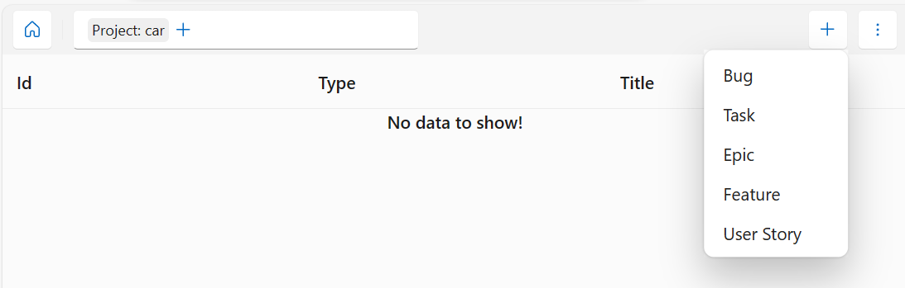
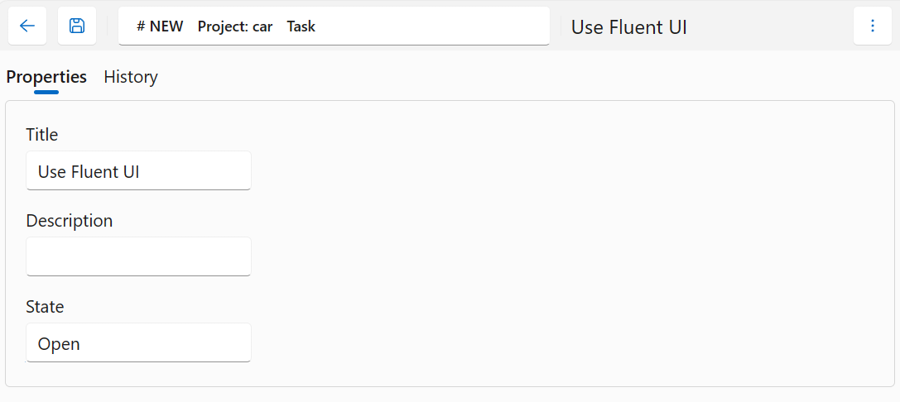
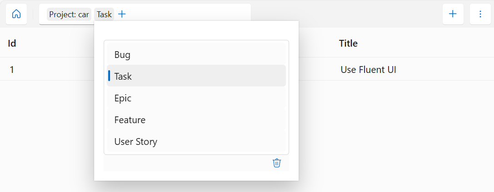
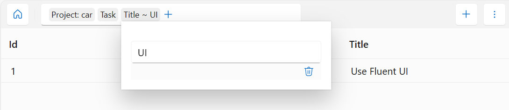
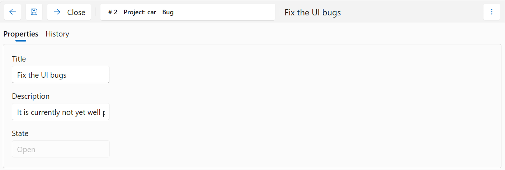

# Screenshots

## Creating a new Work Item

Select from the list of known work item types

Fill their properties (according to the work item description)

## Search for Work Items

By selecting one of the possible values

or matching it against a string

## Edit a Work Item

Editing its properties (if allowed) incl. Actions like "Close"

including a detailed history

